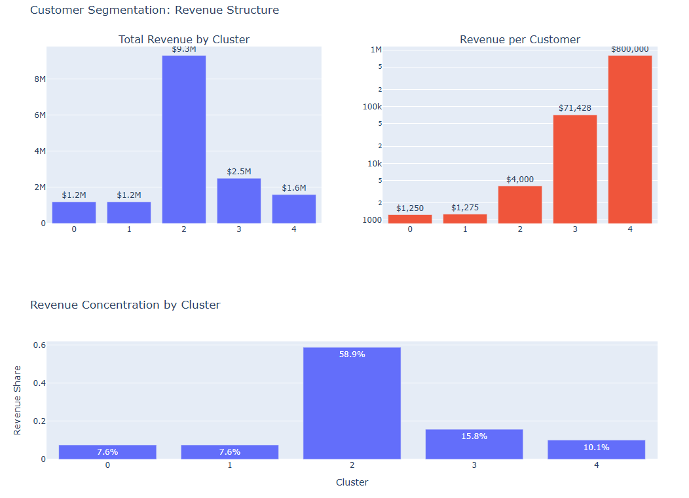

# Customer Segmentation & Churn Prediction Analysis

🚀 **Live Dashboard:** https://strodan84.github.io/customer-segmentation-retention/

## Project Overview

This project uses RFMT customer segmentation and K-Means clustering to identify high-value customer groups, quantify revenue concentration, and highlight customer retention opportunities.

## Dataset

The online retail transaction data set of two years used in this analysis can be found <a href='https://www.kaggle.com/datasets/mashlyn/online-retail-ii-uci?resource=download'>HERE.</a>

### Key Findings

- Cluster 2 generates ~60% of total revenue
- Revenue follows a strong Pareto distribution
- Enterprise and "whale" customers contribute disproportionate value
- Significant upsell opportunities exist within the mid-tier customer base
